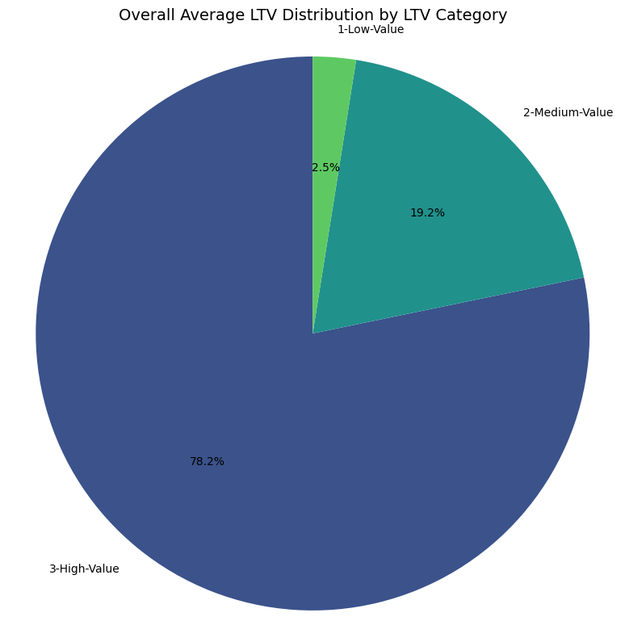
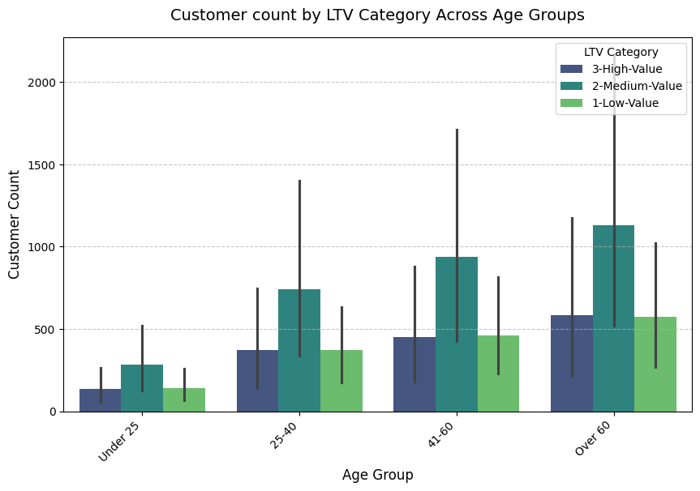
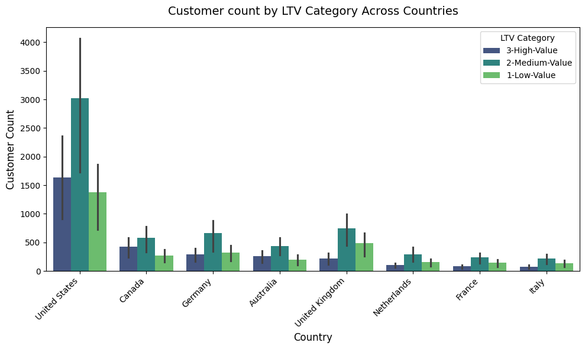
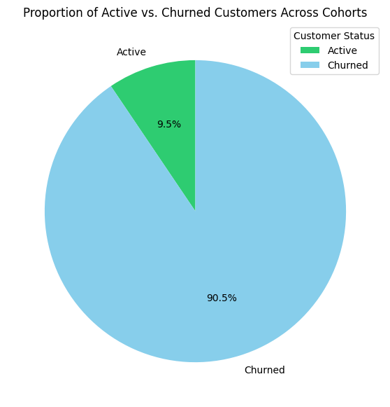
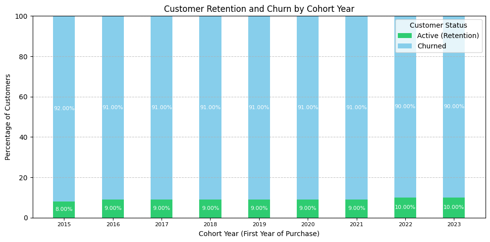
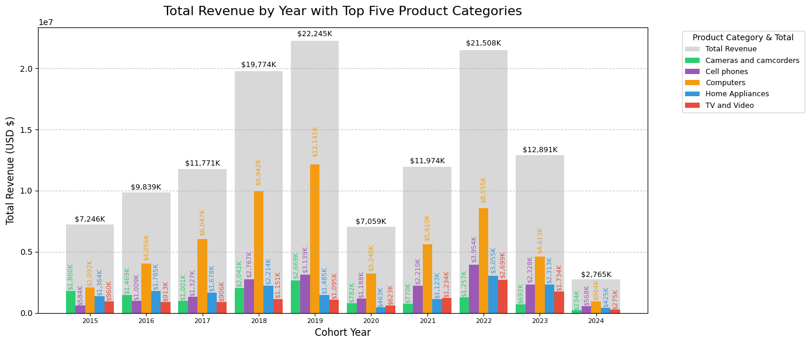
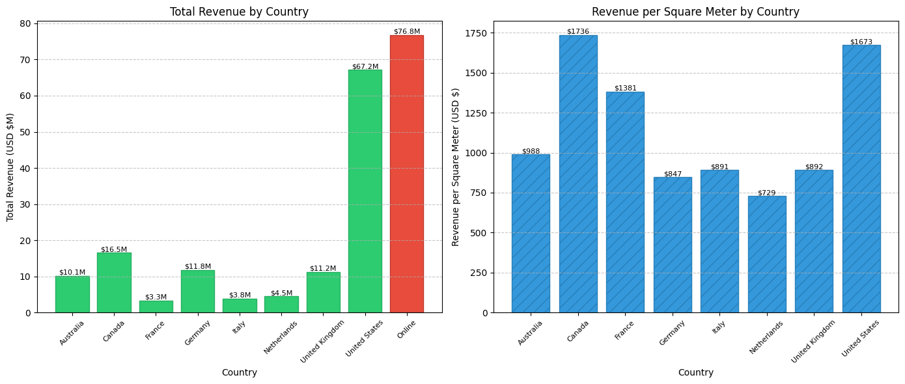

# Intermediate SQL - Sales. Analysis

## Overview
This project analyses the Contoso 100k dataset by Microsoft, a retail sales dataset containing customer, product, and store data, using PostgreSQL to derive actionable insights into customer behaviour, revenue generation, and retention patterns. Leveraging advanced SQL techniques such as window functions, CTEs, and aggregations, the analysis addresses key business questions related to customer segmentation, cohort performance, churn risk, product sales, and store efficiency. The results inform strategic recommendations to optimise customer engagement and maximise revenue. Visualisations are generated using Python (Matplotlib/Seaborn).

## Business Questions
1.**Customer Segmentation Analysis:** What are the key drivers of revenue growth across customer segments?
2.**Cohort Analysis:** How do different customer groups generate revenue?
3.**Retention Analysis:** Which customers churn and what are retention rates?
4.**Key Products** Which products drive sales?
5.**Store Performance** Which stores are more effective per square meter and compared to online sales?

## Data Clean up
**Updated view file**
- Aggregated sales and customer data into revenue metrics
- Calculated first purchase dates for cohort analysis
- Created view combining transactions and customer details

🖥️ Query: [New_VIEW_with_extended_names.sql](Scripts/New_VIEW_with_extended_names.sql)

## Analysis Approach
## 1. Customer Segmentation Analysis
**Objective:** Categorise customers based on total lifetime value (LTV) to identify high-value, medium-value, and low-value segments.
**Methodology:** 
- Calculated total LTV per customer using aggregated revenue.
- Assigned customers to segments (High, Medium, Low) based on the 25th and 75th percentiles of LTV.
- Computed key metrics: total revenue, customer count, and average LTV per segment.

🖥️ Query: [1_Customer_Segmentation_by_Lifetime_Value.sql](Scripts/1_Customer_Segmentation_by_Lifetime_Value.sql)

📈 **Visualization:**
 Pie Chart, lifetime value (LTV) categories

 BoxP Plot, customer count of LTV by categories by age groups

Box PLot, customer count of LTV categories by country

📊 **Key Findings:**
- The high-value segment (25% of customers) generates 66% of revenue ($135.4M).
- The medium-value segment (50% of customers) generates 32% of revenue ($66.6M).
- The low-value segment (25% of customers) accounts for 2% of revenue ($4M).

💡 **Business Insights**
- High-Value (66% revenue): Offer a premium membership programme for 12,372 VIP customers, as losing one significantly impacts revenue.
Medium-Value (32% revenue): Create upgrade paths through personalised promotions to potentially increase revenue from $66.6M to $135.4M.
- Low-Value (2% revenue): Design re-engagement campaigns and price-sensitive promotions to increase purchase frequency.
****
****

### 2. Cohort Analysis
**Objective:** Track revenue and per-customer revenue by cohort, grouped by the year of first purchase, and analyse retention patterns.

- Grouped customers by the year of their first purchase (cohort_year).
- Calculated total customers, total revenue, and average revenue per customer for each cohort.
- Filtered for first purchases to focus on initial cohort behaviour.
****
🖥️ Query: [2_Customer_Revenue_and_First_Purchase_Year.sql](Scripts/2_Customer_Revenue_and_First_Purchase_Year.sql)

📈 **Visualization:**
 Bar Chart, customer revenue by cohort with exponential trend line
_by_Cohort_Year_with_Exponential_Trend.png)

📊 **Key Findings:**
- Revenue per customer shows a critical decreasing trend over time.
- The 2022 and 2024 cohorts perform worse than earlier cohorts.
- Total revenue is increasing, likely due to a larger customer base, but this masks declining per-customer value.

💡 **Business Insights**
- The decreasing customer value over time requires further analysis to identify causes (e.g., product changes, market competition).
- The 2023 drop in customer acquisition warrants investigation into marketing or acquisition strategies.
- Declining LTV and customer acquisition signal a potential future revenue decline.

****
****
### 3. Customer Retention
**Objective:** Identify customers at risk of churning and analyse last purchase patterns.
**Methodology:**
- Used ROW_NUMBER() to identify each customer’s most recent purchase.
- Classified customers as Churned or Active based on whether their last purchase was more than 6 months before the maximum orderdate in the dataset.
- Calculated retention metrics by cohort year.
****

🖥️ Query:
[3_retention_analysis..sql](Scripts/3_Customer_Retention_and_Churn_Analysis_by_Cohort_Year_and_Quarter.sql)
🖥️ Query: [4_Customer_Revenue_and_First_Purchase_Year](Scripts/4_Customer_Revenue_and_First_Purchase_Year.sql)

📈 **Visualization:**
Pie Chart, proportion of active and churned customers

Bar Chart, proportion of active and churned customers by year

📊 **Key Findings:**
- Cohort churn stabilises at ~90% after 2-3 years, indicating predictable long-term retention patterns.
- Retention rates are consistently low (8-10%) across all cohorts, suggesting systemic retention issues.
- Newer cohorts (2022-2023) show similar churn trajectories, indicating no improvement without intervention.

 💡 **Business Insights:**
- Strengthen early engagement strategies with onboarding incentives, loyalty rewards, and personalised offers to improve retention in the first 1-2 years.
- Re-engage high-value churned customers with targeted win-back campaigns to maximise ROI.
- Use predictive analytics to identify and proactively intervene with at-risk customers before they churn.

## Strategic Recommendations
- Placeholder: Implement a premium loyalty programme for high-value customers to increase retention and engagement.
- Develop targeted re-engagement campaigns for low-value customers to boost purchase frequency.
- Investigate the 2023 customer acquisition drop to identify and address underlying causes.
****
****

### 4. Key Producst
**Objective:** Identify the top product categories driving sales and their contribution to total revenue across years
**Methodology:** 
- Aggregated total revenue and customer counts by product category and cohort year using the provided dataset.
-Ranked product categories by total revenue to identify top performers.
-Analysed trends in revenue contribution and customer engagement by category over time.

🖥️ Query: [4_Cohort_Analysis_by_Customer_First_Purchase_Year_and_Quarter.sql](Scripts/4_Cohort_Analysis_by_Customer_First_Purchase_Year_and_Quarter.sql)

📈 **Visualization:**
Bar Plot with sub-bars of top five product sales by year

📊 **Key Findings:**
- Computers consistently dominate, contributing the highest revenue across all years (e.g., $4.06M in Q3-2019, $2.99M in Q2-2022).
-Cell phones and Home Appliances are the next highest contributors, with Cell phones peaking at $1.36M in Q2-2022 and Home Appliances at $1.11M in Q3-2022.
-Lower-revenue categories like Games and Toys ($65.39-$142.46 per customer) have higher customer counts but minimal revenue impact.

💡 **Business Insights**
- Focus marketing and inventory investment on Computers, Cell phones, and Home Appliances to capitalise on their high revenue contribution.
- Explore bundling strategies for low-revenue categories like Games and Toys with high-value products to increase overall basket value.
-Investigate declining per-customer revenue in newer cohorts (e.g., 2023-2024) for Computers and Cell phones to address potential pricing or demand issues.
****
****

### 5. Stores Performance
**Objective:** Evaluate store effectiveness by revenue per square meter and compare physical store performance to online sales. 

**Methodology:** 
-Calculated revenue per square meter for physical stores by dividing total revenue by square meters.
-Compared total revenue and order frequency across countries and the online channel.
-Ranked stores by revenue per square meter to identify top performers.

🖥️ Query 5: [5_Store_Performance_by_Region_and_Country](Scripts/5_Store_Performance_by_Region_and_Country.sql)

📈 **Visualization:**
Bar Charts, total revenue by country vs online and total revenue by square meter in each country

📊 **Key Findings:**
- Online sales dominate with $76.8M in revenue, far surpassing physical stores, with the highest order frequency (2,878 order dates).
- Top-performing physical stores include Store 67 (United States, $3,642.33/sqm) and Store 10 (Canada, $3,446.02/sqm), both with high revenue efficiency.
- Lower-performing stores, such as Store 35 (Netherlands, $6.43/sqm) and Store 52 (United States, $16.48/sqm), have significantly lower revenue per square meter.

💡**Business Insights**
- Prioritise investment in online channels to leverage their dominant revenue contribution and scalability.
- Optimise underperforming stores (e.g., Store 35, Store 52) through operational improvements or consider closure to reallocate resources to high-efficiency stores.
- Expand or replicate strategies from top-performing stores (e.g., Store 67, Store 10) to enhance physical store performance in other regions.
****
****
## Strategic Recommendations:
- Implement a premium loyalty programme for high-value customers to increase retention and engagement.
- Develop targeted re-engagement campaigns for low-value customers to boost purchase frequency.
- Investigate the 2023 customer acquisition drop to identify and address underlying causes.
- Focus inventory and marketing on high-revenue product categories (Computers, Cell phones, Home Appliances) while exploring bundling for low-revenue categories.
- Prioritise online channel investments and optimise underperforming physical stores to improve overall revenue efficiency.
****
****
## Technical Details
- **Database:** PostgreSQL
- **Analysis Tools:** PostgreSQL, DBeaver, VSCode
- **Visualization:** Visualisation: Python (Matplotlib/Seaborn for generating charts and plots)
